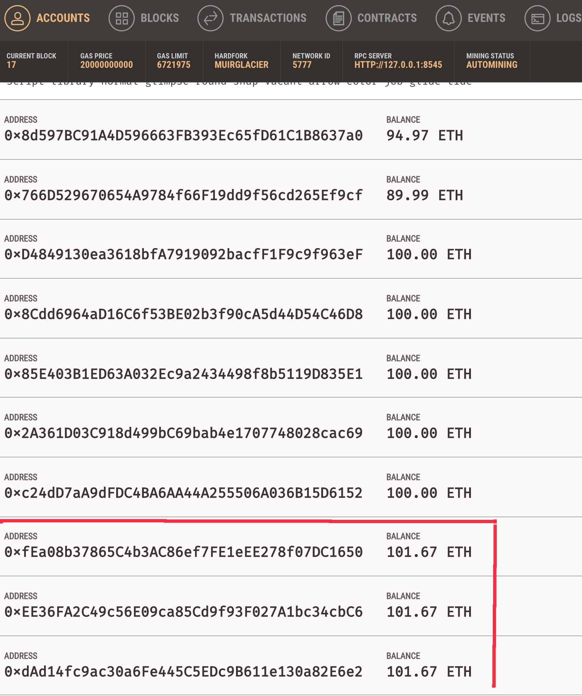

## Background

Creates Ethereum-compatible smart contracts called ProfitSplitter.

These contracts will do several things:

* Pay associate-level employees quickly and easily.

* Distribute profits to different tiers of employees.

* Distribute company shares for employees in a "deferred equity incentive plan" automatically.

## Files

* [`AssociateProfitSplitter.sol`](Starter-Code/AssociateProfitSplitter.sol) — Level 1

* [`TieredProfitSplitter.sol`](Starter-Code/TieredProfitSplitter.sol) — Level 2

* [`DeferredEquityPlan.sol`](Starter-Code/DeferredEquityPlan.sol) — Level 3

## AssociateProfitSplitter

## TieredProfitSplitter

## DeferredEquityPlan

## AssociateProfitSplitter on Ropsten Network

